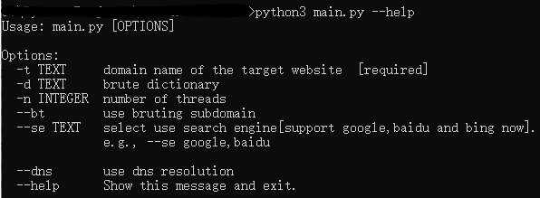

## Subdomain lookup V1.8.1
developing.......  
The functions which are implemented:  
Brute  
multiple thread  
GUI(could select dictionary which you add by yourself)  
Spider  
DNS resolution API
### Usage
#### cmd\shell:
`-t domain name of the target website`  
`-d brute dictionary[optional]`  
`-n numbers of thread[optional]`  
`--bt use bruting subdomain`  
`--se select use search engine[support google,baidu and bing now].e.g., --se google,baidu`  
`--dns use dns resolution`   
  

#### GUI:

